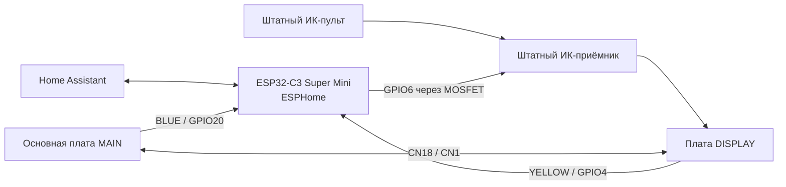

# Умный кондиционер Midea / Castorama на ESP32-C3 + ESPHome

Полностью локальное управление старой сплит-системой Midea/ Castorama через Home Assistant без фирменного Wi‑Fi-модуля и без облака.

Проект разработан и физически проверен на сплит-системе **MSAFA-09HRN1-QC2** (9 000 BTU, Castorama, платформа Midea). Управление построено на ESP32-C3 Super Mini, пассивном чтении внутренней шины между основной платой и платой дисплея, а также эмуляции штатного ИК-приёмника.

> **Статус:** рабочий. Текущая проверенная конфигурация — **v1.5 (2026-09-15)**. Климат, обратная синхронизация, штатный пульт, режимы, температура, вентилятор, swing и постоянная пользовательская настройка «Без звука» работают. Состояние «Без звука» сохраняется при перезапуске Home Assistant Core и повторном подключении ESPHome API. Единственное известное ограничение: после полного OFF → ON первый подтверждающий писк штатного буззера остаётся.

## Что получилось

- управление из Home Assistant через стандартную сущность `climate`;
- режимы `COOL`, `HEAT`, `DRY`, `FAN_ONLY`, `AUTO / HEAT_COOL`;
- управление целевой температурой;
- скорости вентилятора `AUTO / LOW / MEDIUM / HIGH`;
- вертикальный swing;
- штатный ИК-пульт продолжает работать одновременно с ESPHome;
- обратная синхронизация состояния: если изменить режим с обычного пульта, Home Assistant узнаёт реальное состояние кондиционера;
- запоминание последней скорости вентилятора между режимами;
- сохранение пользовательского состояния «Без звука»;
- автоматическое повторное отключение звука после нового включения;
- отсутствие облака: вся логика работает локально через ESPHome + Home Assistant.

## На каком кондиционере проверено

**Внутренний блок:** `MSAFA-09HRN1-QC2`  
**Основная плата:** `CE-KFR26G/Y-AF.D.01.NP-1`, Midea `17122000020810`  
**Плата дисплея:** Midea `17122000020878`, `CE-KFR26G/N1Y-AF10.D.01`  
**MCU платы дисплея:** `SH79F1612A`

Во время исследования также встречалась близкая модель `MSAFA-07HRN1-QC2`, но этот репозиторий следует считать **проверенным именно на MSAFA-09HRN1-QC2**. Даже при совпадении разъёмов и плат перед подключением нужно проверить распиновку мультиметром.

## Идея проекта

В этой ревизии кондиционера нет отдельного разъёма для фирменного Wi‑Fi-модуля. Поэтому управление реализовано не через штатный Wi‑Fi/UART-порт, а через две уже существующие части кондиционера:

1. ESP32 пассивно слушает обмен между MAIN и DISPLAY и восстанавливает фактическое состояние кондиционера.
2. Для команд ESP32 эмулирует выход штатного ИК-приёмника. С точки зрения платы дисплея это выглядит как обычная команда с родного пульта.
3. Плата дисплея сама формирует штатные команды для MAIN, поэтому основная силовая плата не модифицируется.

Это позволяет одновременно сохранить обычный пульт и получить двустороннюю синхронизацию с Home Assistant.

## Архитектура



ESP **не разрывает** штатную связь MAIN ↔ DISPLAY. BLUE и YELLOW читаются пассивно через делители напряжения. В штатный ИК-вход добавляется только параллельная инъекция через N-MOSFET.

## Что нужно из железа

| Компонент | Назначение |
|---|---|
| ESP32-C3 Super Mini | ESPHome, Home Assistant, декодирование шины |
| 2 × 47 кОм | верхние резисторы делителей BLUE/YELLOW |
| 2 × 68 кОм | нижние резисторы делителей BLUE/YELLOW |
| N-MOSFET AO3400 / A09T или аналогичный logic-level | эмуляция выхода ИК-приёмника |
| 1 кОм | резистор в Gate MOSFET |
| 100 кОм | подтяжка Gate к GND |
| монтажный провод | соединения |

Подробная распиновка и схема: **[docs/WIRING.md](docs/WIRING.md)**.

## Шина MAIN ↔ DISPLAY

Разъём MAIN `CN18` ↔ DISPLAY `CN1` имеет четыре провода:

| Провод | Назначение | Подключение к ESP |
|---|---|---|
| BLACK | GND | общий GND |
| RED | +5 V | питание линии; **не подключать напрямую к 3V3 GPIO** |
| BLUE | MAIN → DISPLAY | GPIO20 через делитель 47к/68к |
| YELLOW | DISPLAY → MAIN | GPIO4 через делитель 47к/68к |

Для BLUE аппаратный UART на ESP32-C3 показал себя нестабильно. В рабочем варианте используется **RMT + программный UART-декодер 2400 baud**. YELLOW читается аппаратным UART на **2400 8N1**.

## ИК-управление

Штатный пульт использует протокол **Coolix**. ESP не ставит отдельный ИК-светодиод: GPIO6 через MOSFET подключён к выходу штатного ИК-приёмника и имитирует его импульсы. Сам штатный ИК-приёмник остаётся подключён, поэтому обычный пульт продолжает работать.

Проверенные специальные команды:

| Действие | Coolix |
|---|---|
| OFF | `0xB27BE0` |
| SWING | `0xB26BE0` |
| Display / Sound toggle | `0xB5F5A5` |
| FAN_ONLY AUTO | `0xB2BFE4` |
| FAN_ONLY LOW | `0xB29FE4` |
| FAN_ONLY MEDIUM | `0xB25FE4` |
| FAN_ONLY HIGH | `0xB23FE4` |

## Текущая стабильная версия v1.5

В v1.5 исправлена отдельная проблема восстановления сущности `Без звука` после перезапуска Home Assistant. Климатическая логика v1.4 не переписывалась.

Что изменено:

- `mute_desired` остаётся единственным каноническим persistent-состоянием пользовательского пожелания;
- для template-switch используется `restore_mode: DISABLED`, чтобы инициализация ESPHome не могла выполнить `turn_off_action` и затереть восстановленное значение;
- после загрузки ESP сохранённое состояние только публикуется в Home Assistant;
- при новом подключении клиента ESPHome API состояние также только повторно публикуется;
- само переподключение Home Assistant **никогда не отправляет** `0xB5F5A5` кондиционеру;
- 15.09.2026 физически проверено: при `Без звука = ON` обычный **«Перезапуск Home Assistant»** сохраняет переключатель включённым после восстановления связи.

Важно: публичный YAML использует `!secret` для Wi‑Fi, ключа API и пароля fallback AP. Реальные секреты в репозиторий не публикуются.

## «Без звука» и почему первый писк остаётся

На этом кондиционере `0xB5F5A5` — это **toggle**, который одновременно отключает индикацию передней панели и штатный буззер.

Когда кондиционер уже работает, команда надёжно переводит его в тихое состояние. В конфиге предпочтение пользователя сохраняется в ESPHome, поэтому после OFF → ON система автоматически повторно отправляет `B5F5A5`.

Но именно **первый писк включения** убрать не удалось. Это проверялось несколькими способами:

- отправкой `B5F5A5` до команды ON;
- отправкой mute практически сразу после OFF;
- попыткой объединить mute и ON через штатный ИК-тракт;
- прямой программной передачей сервисного пакета в YELLOW.

MAIN либо сбрасывает mute при переходе OFF → ON, либо формирует стартовый писк раньше, чем новое состояние mute становится активным. В рабочем финальном варианте это принято как аппаратное ограничение: **один писк при полном включении остаётся, все последующие команды работают без звука**.

Подробнее: **[docs/DEVELOPMENT.md](docs/DEVELOPMENT.md)** и **[docs/PROTOCOL.md](docs/PROTOCOL.md)**.

## Установка

1. Соберите схему из `docs/WIRING.md`.
2. Скопируйте `esphome/secrets.example.yaml` в `esphome/secrets.yaml` и заполните свои значения.
3. Добавьте `esphome/wifi-air-conditioner.yaml` в ESPHome.
4. Прошейте ESP32-C3.
5. Добавьте устройство ESPHome в Home Assistant.
6. Проверьте сначала чтение состояний и только потом ИК-инъекцию.

Конфиг разработан и проверен на **ESPHome 2026.8.2**, ESP32-C3, framework **ESP-IDF**. Текущая проверенная конфигурация v1.5 успешно загружалась сборкой от 2026-09-15 и прошла подтверждение `Boot seems successful` в ESPHome.

## Структура репозитория

```text
midea-castorama-esphome/
├── README.md
├── CHANGELOG.md
├── LICENSE
├── .gitignore
├── esphome/
│   ├── wifi-air-conditioner.yaml
│   └── secrets.example.yaml
└── docs/
    ├── WIRING.md
    ├── PROTOCOL.md
    ├── DEVELOPMENT.md
    └── TROUBLESHOOTING.md
```

## Важное по безопасности

Внутри сплит-системы присутствует сетевое напряжение. Все работы выполняйте только при полностью отключённом питании. Этот проект касается низковольтной линии платы дисплея; не лезьте в силовую часть MAIN под напряжением.

Также не подключайте линии BLUE/YELLOW напрямую к GPIO ESP32-C3: уровни выше допустимых для 3,3-вольтовой логики. В прототипе используются делители 47 кОм / 68 кОм.

## Лицензия

Программная часть опубликована под лицензией **MIT**. Использование проекта и модификация бытовой техники выполняются на ваш риск.

## Автор

Проект: **Nikita Ostrokolov / OstrokolovNikita**.  
Разработан как практический локальный мод Home Assistant / ESPHome для старых сплит-систем Midea без штатного Wi‑Fi-разъёма.
