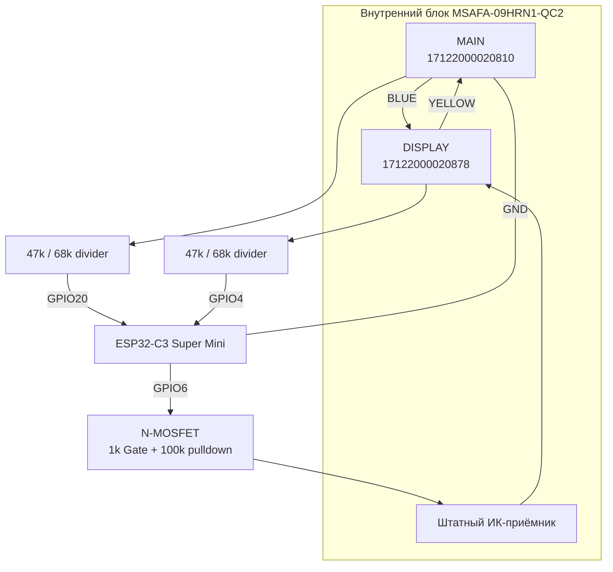

# Подключение ESP32-C3

## Внутренняя линия кондиционера

На исследованной Midea `MSAFA-09HRN1-QC2` связь между основной платой и платой дисплея идёт по четырём проводам MAIN `CN18` ↔ DISPLAY `CN1`.

| Цвет | Назначение |
|---|---|
| BLACK | GND |
| RED | +5 V |
| BLUE | MAIN → DISPLAY |
| YELLOW | DISPLAY → MAIN |

Распиновка была определена прозвонкой и измерением напряжений. Перед повторением проекта на другой ревизии платы обязательно перепроверьте её самостоятельно.

## BLUE — чтение MAIN → DISPLAY

```text
BLUE ---- 47 kΩ ----+---- GPIO20
                    |
                   68 kΩ
                    |
                   GND
```

GPIO20 работает только как вход. В прошивке BLUE декодируется через RMT + программный UART-декодер, потому что обычный hardware UART на этой линии давал нестабильный результат.

## YELLOW — чтение DISPLAY → MAIN

```text
YELLOW -- 47 kΩ ----+---- GPIO4
                    |
                   68 kΩ
                    |
                   GND
```

GPIO4 используется как вход аппаратного UART 2400 8N1.

> В раннем эксперименте GPIO4 временно переводился в OUTPUT для прямой передачи в YELLOW. Из-за 47 кОм последовательного сопротивления уровни искажались и MAIN не принимал кадры стабильно. В финальной версии GPIO4 — только RX.

## ИК-инъекция

ESP эмулирует логический выход штатного ИК-приёмника. Сам приёмник не отключается.

```text
GPIO6 ---- 1 kΩ ---- Gate N-MOSFET
                     |
                   100 kΩ
                     |
                    GND

MOSFET Source ------ GND
MOSFET Drain ------- OUT штатного ИК-приёмника
```

Использовался малосигнальный logic-level N-MOSFET типа **AO3400 / A09T**.

GPIO6 через MOSFET только притягивает выход ИК-приёмника к GND. Это позволяет ESP воспроизводить логический сигнал Coolix, а штатный ИК-пульт продолжает работать параллельно.

## Общая схема



## Питание ESP

На CN18 присутствует RED `+5 V`, но конкретный способ питания ESP в этом репозитории намеренно не фиксируется как универсальный: разные ESP32-C3 Super Mini могут иметь отличия по входу питания и стабилизатору.

Используйте только тот 5-вольтовый вход платы ESP, который допускает производитель вашей конкретной платы, либо отдельное стабилизированное питание. Общий GND с кондиционером обязателен.

**Никогда не подавайте 5 V на вывод 3V3 или сигнальный GPIO.**
